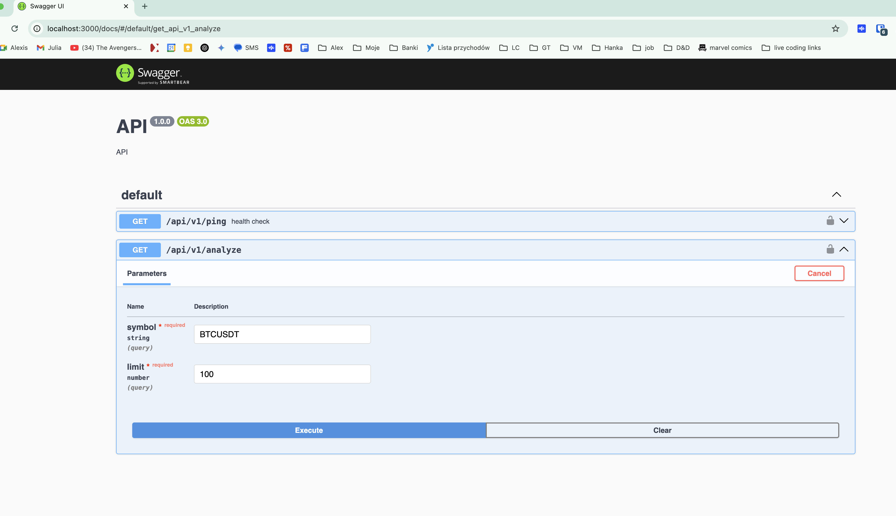
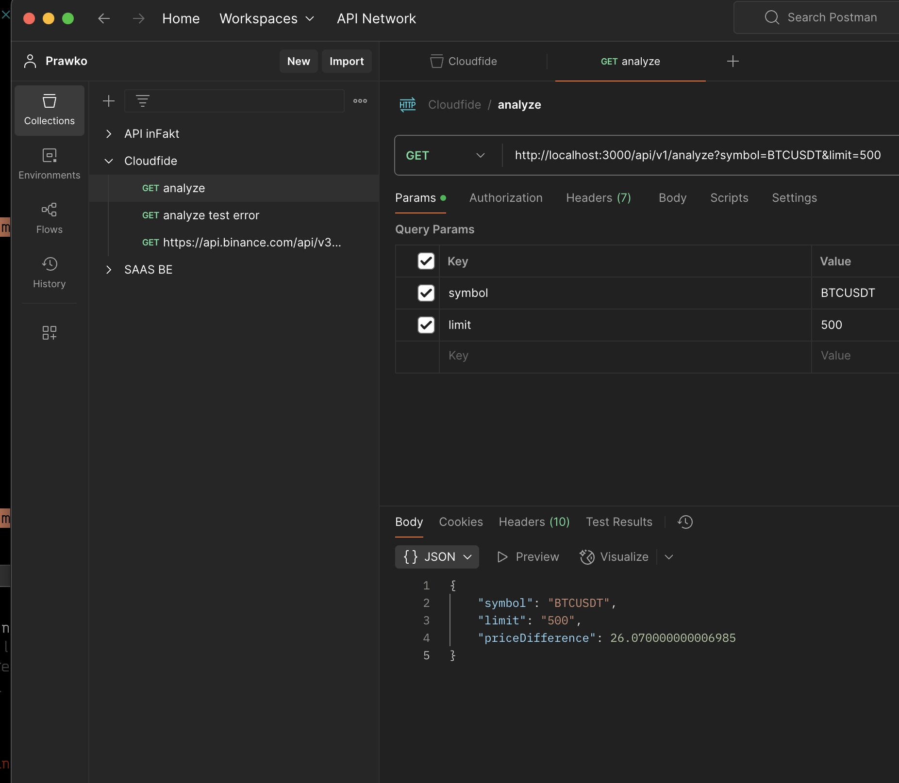

# Cloudfide

postman: [postman_collection.json](postman_collection.json)

## Install:
npm install

## run
npm run dev

## production
node index.js

## swagger docs
http://localhost:3000/docs/

## Task:
### Ruleset:
- Time limit – 120 minutes – (apply best practices)
- Allowed tools: almost all
- Not allowed tools: AI Code Generators
- Commit the codebase every +- 10 minutes to capture your progress
- Store the code in the public GitHub Repo
- Don’t include the content of the tasks in the repo
- Linters are allowed
- IntelliSense is allowed
- Preferably Express/Nest, the result needs to be an API/web app

### Overall success criteria:
Code is buildable and can be started with the command: npm run dev or equivalent
Startup commands are documented in the Readme file
Features are fully developed and working according to the high-level brief

### Description:
Your task is to create a Node.js application that fetches and analyzes changes happening on the Binance cryptocurrency exchange over a specific period of time. The application should include a subset of test cases to ensure the functionality of fetching and analyzing the exchange data.

### Requirements:
Sign up for a Binance API key to access the Binance API.
Create a Node.js application that integrates with the Binance API.
Implement the following functionality:
Fetch historical market data for a specific cryptocurrency symbol and time range using the API.
Analyze the fetched data to identify changes in cryptocurrency prices, such as increases or decreases, over the specified time period.
Display the analyzed data in a formatted manner.
Write test cases to validate the following scenarios:
Successful retrieval of historical market data from the Binance API.
Proper analysis and identification of cryptocurrency price changes.
Use a testing framework like Mocha or Jest to write and execute the test cases.
Handle any necessary test setup and teardown operations.

### Note:
Use the Binance API documentation (https://developers.binance.com/en) to understand the available endpoints and their usage.
You can use any npm packages or libraries that you find useful for making API requests and analyzing the market data.
Focus on writing clean, maintainable, and well-documented code.
Consider mocking the API responses during testing to avoid making actual API calls.
Make sure to handle the data processing and analysis logic to identify cryptocurrency price changes accurately.

### Deliverables:
Provide the source code for the Node.js application, including the test suite.
Include a README file with instructions on how to set up and run the application and the test suite.
Developer Center
